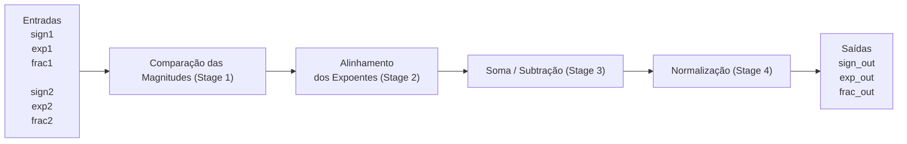
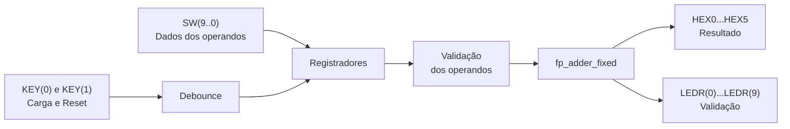
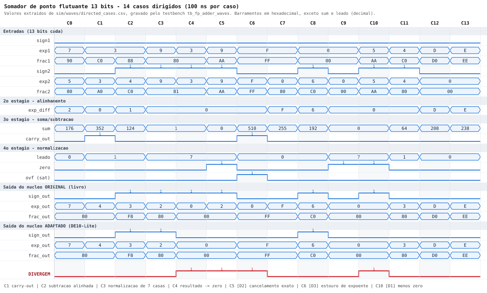

teste

# Tutorial: Implementação de Somador Ponto Flutuante na DE10-Lite

**Autores:** Daniel Mendes Vale de Sá (11201921422), Gabrielly Souza Santiago (11202231242), Pedro Henrique de Moraes Lui (11201722622).

**Disciplina:** Sistemas Digitais Q2.2026

**Data:** 07/08/2026

---
*Etapa 1*
## 1. Objetivo do Projeto
O objetivo deste projeto é validar o funcionamento do somador de ponto flutuante simplificado de 13 bits, adaptá-lo para a placa DE10-Lite e verificar, por meio de simulações e testes na FPGA, que as modificações realizadas não alteram a lógica matemática do circuito.

## 2. Descrição gráfica do funcionamento do sistema

O sistema implementa um somador de ponto flutuante simplificado de 13 bits. Cada operando possui três campos:

| Campo        | Quantidade de bits | Entradas do operando A | Entradas do operando B |
| ------------ | -----------------: | ---------------------- | ---------------------- |
| Sinal (s)    |                  1 | `sign1`                | `sign2`                |
| Expoente (e) |                  4 | `exp1(3 downto 0)`     | `exp2(3 downto 0)`     |
| Fração (f)   |                  8 | `frac1(7 downto 0)`    | `frac2(7 downto 0)`    |

O valor representado por cada operando é:

$$
valor = (-1)^s \times 0.f \times 2^e
$$

Considerando a fração como um número inteiro de 8 bits, tem-se:

$$
valor = (-1)^s \times \frac{f}{256} \times 2^e
$$

O circuito recebe dois operandos e realiza a soma em quatro etapas principais: comparação das magnitudes, alinhamento dos expoentes, soma (ou subtração) das frações e normalização do resultado.



### Entradas e saídas

| Sinal | Tipo | Descrição |
|:------|:----:|:----------|
| `sign1` | Entrada | Bit de sinal do primeiro operando |
| `exp1` | Entrada | Expoente do primeiro operando |
| `frac1` | Entrada | Fração do primeiro operando |
| `sign2` | Entrada | Bit de sinal do segundo operando |
| `exp2` | Entrada | Expoente do segundo operando |
| `frac2` | Entrada | Fração do segundo operando |
| `sign_out` | Saída | Bit de sinal do resultado |
| `exp_out` | Saída | Expoente do resultado |
| `frac_out` | Saída | Fração do resultado |

### 2.1 Primeiro estágio: ordenação dos operandos

O primeiro estágio identifica qual operando possui a maior magnitude.

A comparação é feita usando a concatenação do expoente com a fração:

```vhdl
exp1 & frac1
exp2 & frac2
```

A condição utilizada é equivalente a:

```vhdl
if (exp1 & frac1) > (exp2 & frac2) then
    -- operando 1 é o maior
else
    -- operando 2 é o maior
end if;
```

O maior operando é armazenado nos sinais terminados em `b`, de *big*:

```text
signb
expb
fracb
```

O menor operando é armazenado nos sinais terminados em `s`, de *small*:

```text
signs
exps
fracs
```

### 2.2 Segundo estágio: alinhamento dos expoentes

Para somar dois números de ponto flutuante, as duas frações precisam estar associadas ao mesmo expoente.

Primeiro é calculada a diferença entre os expoentes:

```vhdl
exp_diff <= expb - exps;
```

Como `expb` pertence ao operando de maior magnitude, a diferença é sempre maior ou igual a zero.

Depois, a fração do menor operando é deslocada para a direita:

```vhdl
fraca <= shift_right(fracs, to_integer(exp_diff));
```

O sufixo `a` indica que o valor está alinhado, de *aligned*.

### 2.3 Terceiro estágio: soma ou subtração

O circuito utiliza representação sinal-magnitude. Por isso, a operação depende dos sinais dos operandos.

| Condição         | Operação                 |
| ---------------- | ------------------------ |
| `signb = signs`  | Soma das magnitudes      |
| `signb /= signs` | Subtração das magnitudes |

A operação pode ser representada por:

```vhdl
sum <= ('0' & fracb) + ('0' & fraca) when signb = signs else
       ('0' & fracb) - ('0' & fraca);
```

As frações possuem 8 bits, mas a soma é feita com 9 bits:

```text
'0' & fracb
'0' & fraca
```

O bit adicional permite armazenar o carry da soma:

```text
sum(8) = carry-out
```

O sinal do resultado é inicialmente o sinal do operando de maior magnitude:

```vhdl
signn <= signb;
```

Isso ocorre porque, em uma subtração entre magnitudes, o resultado possui o sinal do operando de maior módulo.

### 2.4 Quarto estágio: normalização

Após a soma ou subtração, o resultado pode não estar no formato normalizado esperado.

O quarto estágio realiza três operações:

1. verifica se houve carry;
2. conta os zeros à esquerda;
3. ajusta a fração e o expoente.

#### Contagem de zeros à esquerda

O sinal `leado` informa quantos deslocamentos para a esquerda são necessários para colocar o primeiro bit `1` na posição mais significativa da fração.

| `sum(7 downto 0)` | `leado` |
| ----------------- | ------- |
| `1xxxxxxx`        | `000`   |
| `01xxxxxx`        | `001`   |
| `001xxxxx`        | `010`   |
| `0001xxxx`        | `011`   |
| `00001xxx`        | `100`   |
| `000001xx`        | `101`   |
| `0000001x`        | `110`   |
| `00000001`        | `111`   |

O deslocamento é feito por:

```vhdl
sum_norm <= shift_left(sum(7 downto 0), to_integer(leado));
```

#### Decisão do resultado final

| Situação               | Operação                                                                  |
| ---------------------- | ------------------------------------------------------------------------- |
| Resultado igual a zero | Sinal, expoente e fração são zerados                                |
| Carry igual a `1`      | Fração deslocada uma posição para a direita e expoente incrementado |
| `leado > expb`         | Resultado considerado pequeno demais e convertido em zero                 |
| Caso normal            | Fração deslocada para a esquerda e expoente reduzido                |

*Etapa 2*
## 3. Adaptações de Hardware (DE10-Lite)
O projeto original foi desenvolvido para uma plataforma FPGA diferente da DE10-Lite. Para possibilitar sua utilização na placa, foi criada uma nova interface de hardware, preservando a lógica matemática do somador de ponto flutuante e adaptando apenas os módulos responsáveis pela interação com o usuário e pela visualização dos resultados.

### O que mudamos no VHDL original

- **Removemos o módulo `disp_mux`.** No circuito original, os quatro displays de sete segmentos compartilhavam os mesmos sinais e eram acionados alternadamente pelo módulo `disp_mux`. Como a DE10-Lite possui seis displays independentes (`HEX0` a `HEX5`), esse módulo deixou de ser necessário e foi removido.

- **Removemos os operandos fixos.** O circuito original utilizava parte dos operandos fixa porque a placa possuía poucas chaves de entrada. Na DE10-Lite, os dois operandos passaram a ser armazenados em registradores e carregados campo a campo pelas chaves e botões, permitindo representar qualquer combinação de entradas.

- **Reorganizamos as entradas.** As chaves `SW(9 downto 8)` passaram a selecionar o campo que será carregado e `SW(7 downto 0)` fornecem os dados. O botão `KEY(0)` realiza a carga do campo selecionado e `KEY(1)` executa o reset. Como os botões da DE10-Lite são ativos em nível baixo, foi necessário adaptar essa lógica e adicionar um circuito de *debounce*, garantindo que cada pressão do botão fosse reconhecida apenas uma vez.

- **Roteamos sinais internos para os LEDs.** Alguns sinais internos do somador foram ligados aos LEDs (`LEDR`) para facilitar a visualização do funcionamento do circuito durante os testes na placa.

- **Adicionamos a validação dos operandos.** No circuito original, a fração era montada de forma que o bit mais significativo fosse sempre `1`, garantindo que o operando estivesse normalizado. Como na DE10-Lite os operandos são carregados livremente pelas chaves, passou a ser possível inserir valores não normalizados. Nesses casos, o circuito poderia identificar incorretamente o operando de maior magnitude e produzir resultados com sinal e magnitude incorretos. Para evitar esse problema, foi adicionada uma etapa de validação entre os registradores e o núcleo do somador. Se um operando não estiver normalizado e também não representar o zero canônico, ele é tratado como zero, e essa condição é indicada ao usuário no painel da placa.

### Descrição gráfica do sistema



### Interface da DE10-Lite

| Recurso | Função |
|---------|--------|
| `SW(9 downto 8)` | Seleciona o campo do operando que será carregado |
| `SW(7 downto 0)` | Dados do campo selecionado |
| `KEY(0)` | Carrega o campo selecionado |
| `KEY(1)` | Reinicia os registradores com os valores padrão |
| `HEX5` | Sinal do resultado |
| `HEX4` e `HEX3` | Fração do resultado |
| `HEX2` | Expoente do resultado |
| `HEX1` e `HEX0` | Exibem o campo carregado e indicam operandos inválidos |
| `LEDR(3 downto 0)` | Diferença entre os expoentes (`exp_diff`) |
| `LEDR(6 downto 4)` | Quantidade de zeros à esquerda (`leado`) |
| `LEDR(7)` | Carry da soma |
| `LEDR(8)` | Resultado igual a zero |
| `LEDR(9)` | Overflow do expoente |

Os valores apresentados nos displays de sete segmentos são exibidos em formato hexadecimal. Dessa forma, cada display representa 4 bits do valor correspondente. Por exemplo, uma fração `10100000` é exibida como `A0` nos displays, pois `1010 = A` e `0000 = 0`.

### Seleção dos campos dos operandos por SW(9 downto 8)

| `SW(9 downto 8)` | Campo carregado                | Dados                      |
| ---------------- | ------------------------------ | -------------------------- |
| `00`             | Fração do operando A           | `SW(7 downto 0)`           |
| `01`             | Sinal e expoente do operando A | `SW(4)` e `SW(3 downto 0)` |
| `10`             | Fração do operando B           | `SW(7 downto 0)`           |
| `11`             | Sinal e expoente do operando B | `SW(4)` e `SW(3 downto 0)` |

## 4. Evidências de Validação

### Simulação

Para validar o funcionamento do somador, foram realizados **14 casos de teste dirigidos**. A simulação permite observar as entradas, os sinais internos dos estágios de alinhamento, soma/subtração e normalização, além de comparar diretamente as saídas do núcleo original do livro com as saídas do núcleo adaptado para a DE10-Lite.



**Figura 1 – Comparação entre o somador original e o somador adaptado no GTKWave.**

Entre os casos simulados, destacam-se quatro situações relacionadas ao 4º estágio do circuito, responsável pela normalização:

| Caso | Situação | Resultado observado |
|:----:|----------|---------------------|
| `C1` | Carry-out | O sinal `carry_out` é ativado e o resultado é normalizado com o ajuste do expoente. |
| `C3` | Normalização de 7 casas | `leado = 7`, indicando que a fração precisa ser deslocada 7 posições para a esquerda para ser normalizada. |
| `C4` | Resultado igual a zero | O sinal `zero` é ativado e o resultado é representado com expoente e fração iguais a zero. |
| `C6` | Estouro do expoente | O sinal `ovf` é ativado, indicando que o resultado ultrapassou o maior expoente representável. |

### Comparação entre o circuito original e o adaptado

A simulação também compara diretamente as saídas do núcleo original do livro com as saídas do núcleo adaptado para a DE10-Lite.

O sinal `DIVERGEM`, apresentado na parte inferior da simulação, indica os casos em que as duas implementações produzem resultados diferentes.

Essas divergências são esperadas e ocorrem em situações específicas nas quais o circuito adaptado corrige limitações identificadas no circuito original.

| Caso | Situação | Motivo da divergência |
|:----:|----------|-----------------------|
| `C4` | Resultado igual a zero | A versão adaptada trata corretamente a representação do resultado nulo. |
| `C5` | Cancelamento exato | A versão adaptada gera o zero canônico quando os operandos se anulam. |
| `C6` | Estouro do expoente | A versão adaptada trata o limite máximo do expoente. |
| `C10` | Zero negativo | A versão adaptada evita a representação do zero com sinal negativo. |

### Código VHDL Final

A implementação final mantém o núcleo do somador e adiciona os elementos necessários para sua utilização na DE10-Lite. A seguir são apresentados os principais trechos da adaptação.

#### Carregamento dos operandos

Os operandos são armazenados em registradores. As chaves `SW(9 downto 8)` selecionam qual campo será carregado.

```vhdl
process(clk)
begin
   if rising_edge(clk) then
      if reset = '1' then
         a_sign <= A_SIGN_RST;
         a_exp  <= A_EXP_RST;
         a_frac <= A_FRAC_RST;
         b_sign <= B_SIGN_RST;
         b_exp  <= B_EXP_RST;
         b_frac <= B_FRAC_RST;

      elsif load_en = '1' then
         case SW(9 downto 8) is
            when "00" =>
               a_frac <= SW(7 downto 0);

            when "01" =>
               a_sign <= SW(4);
               a_exp  <= SW(3 downto 0);

            when "10" =>
               b_frac <= SW(7 downto 0);

            when others =>
               b_sign <= SW(4);
               b_exp  <= SW(3 downto 0);
         end case;
      end if;
   end if;
end process;
```

#### Debounce dos botões

Os botões `KEY(0)` e `KEY(1)` passam por um circuito de *debounce*, garantindo que cada pressão seja reconhecida apenas uma vez.

```vhdl
deb_reset : entity work.debounce
   generic map (CNT_BITS => DEB_BITS)
   port map (
      clk   => clk,
      reset => '0',
      din   => key1_press,
      level => reset,
      rise  => open,
      fall  => open
   );

deb_load : entity work.debounce
   generic map (CNT_BITS => DEB_BITS)
   port map (
      clk   => clk,
      reset => reset,
      din   => key0_press,
      level => open,
      rise  => load_pulse,
      fall  => open
   );
```

#### Validação dos operandos

Antes de serem enviados ao núcleo do somador, os operandos são verificados. Um operando é válido quando sua fração está normalizada ou quando representa o zero canônico.

```vhdl
a_ok <= '1' when a_frac(7) = '1'
                or (a_frac = "00000000" and a_exp = "0000") else '0';

b_ok <= '1' when b_frac(7) = '1'
                or (b_frac = "00000000" and b_exp = "0000") else '0';

a_sign_eff <= a_sign when a_ok = '1' else '0';
a_exp_eff  <= a_exp  when a_ok = '1' else "0000";
a_frac_eff <= a_frac when a_ok = '1' else "00000000";

b_sign_eff <= b_sign when b_ok = '1' else '0';
b_exp_eff  <= b_exp  when b_ok = '1' else "0000";
b_frac_eff <= b_frac when b_ok = '1' else "00000000";
```

#### Conexão com o núcleo do somador

Após o carregamento e a validação, os operandos são enviados ao núcleo `fp_adder_fixed`.

```vhdl
fp_add_unit : entity work.fp_adder_fixed
   port map (
      sign1 => a_sign_eff,
      sign2 => b_sign_eff,

      exp1  => a_exp_eff,
      exp2  => b_exp_eff,

      frac1 => a_frac_eff,
      frac2 => b_frac_eff,

      sign_out => r_sign,
      exp_out  => r_exp,
      frac_out => r_frac,

      dbg_exp_diff => d_expdiff,
      dbg_leado    => d_leado,
      dbg_carry    => d_carry,
      dbg_zero     => open,
      dbg_ovf      => d_ovf
   );
```

#### Displays e LEDs de diagnóstico

O resultado é enviado aos displays de sete segmentos e os sinais internos são apresentados nos LEDs para facilitar a validação do circuito.

```vhdl
HEX5 <= '1' & SSEG_MINUS when r_sign = '1'
        else '1' & SSEG_BLANK;

u_hex4 : entity work.hex_to_sseg
   port map (
      hex  => r_frac(7 downto 4),
      dp   => '0',
      sseg => HEX4
   );

u_hex3 : entity work.hex_to_sseg
   port map (
      hex  => r_frac(3 downto 0),
      dp   => '1',
      sseg => HEX3
   );

u_hex2 : entity work.hex_to_sseg
   port map (
      hex  => r_exp,
      dp   => '0',
      sseg => HEX2
   );

LEDR(3 downto 0) <= d_expdiff;
LEDR(6 downto 4) <= d_leado;
LEDR(7)          <= d_carry;
LEDR(8)          <= r_is_zero;
LEDR(9)          <= d_ovf;
```

*Etapa 3*

### Funcionamento na Placa

Após a validação por simulação, o circuito foi testado na DE10-Lite utilizando os mesmos casos principais do 4º estágio de normalização. Os resultados são apresentados nos displays `HEX`, enquanto os LEDs `LEDR` indicam sinais internos utilizados para diagnóstico.

#### Caso C1 – Carry-out

Neste caso, ocorre carry na soma. O resultado é normalizado com ajuste do expoente e o `LEDR(7)` é acionado.


#### Caso C3 – Normalização de 7 casas

Neste caso, o resultado precisa ser deslocado 7 posições para a esquerda para ser normalizado. Os LEDs `LEDR(6 downto 4)` indicam `111`, correspondente a `leado = 7`.


#### Caso C4 – Resultado igual a zero

Neste caso, o resultado da operação é zero. Os displays apresentam a representação do zero e o `LEDR(8)` é acionado.


#### Caso C6 – Estouro do expoente

Neste caso, o resultado exige um expoente maior que o valor máximo representável. O `LEDR(9)` é acionado para indicar o overflow.


*Etapa 4
## 5. Diário de Bordo de IA 
Utilizamos o [ChatGPT/Claude/Gemini] para auxiliar na geração do Testbench e na refatoração do código. Abaixo está a análise crítica do uso da ferramenta.

**Prompts Utilizados:**
> "Insira aqui o prompt exato que você usou..."

**O Erro da IA (Alucinação):**
> Descreva aqui o que a IA errou (ex: tentou usar pinos inexistentes, criou clock em testbench de circuito combinacional, etc).

**A Correção Humana:**
> Como você corrigiu o código gerado para que ele funcionasse na nossa placa e na simulação.

## 6. Contribuição dos participantes
 * Daniel Mendes Vale de Sá, Administração do Projeto, Desenvolvimento, implementação e teste de software, Análise Formal
 * Gabrielly Souza Santiago, Redação do manuscrito original, Documentação técnica
 * Pedro Henrique de Moraes Lui, Redação do manuscrito original, Validação de dados e experimentos
