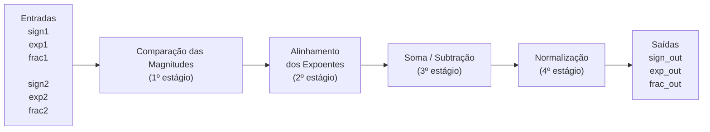
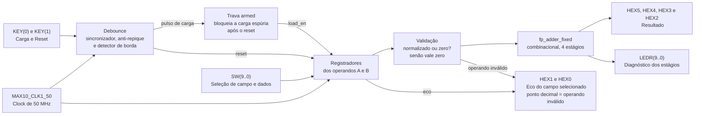
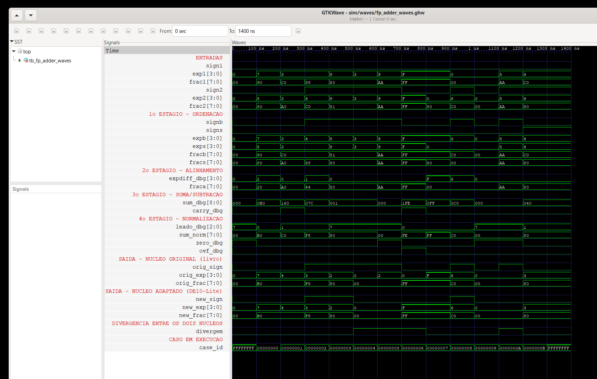
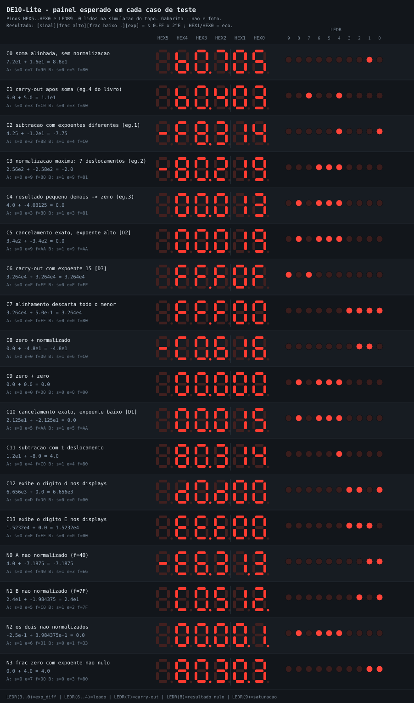
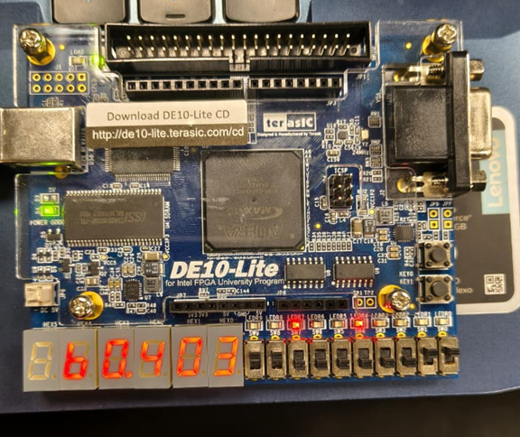
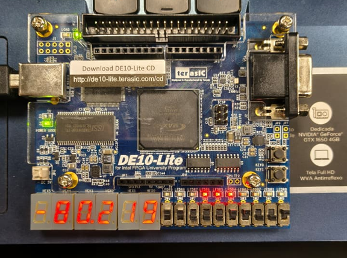
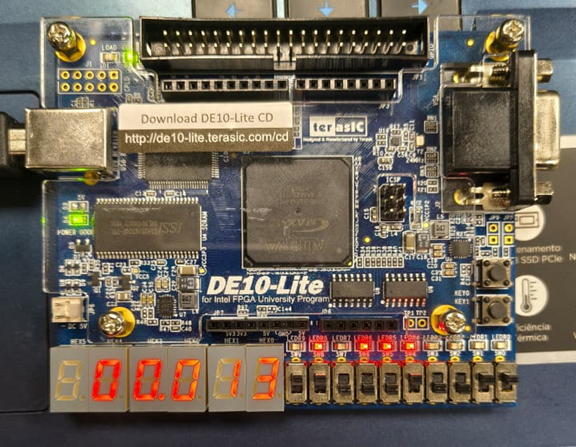
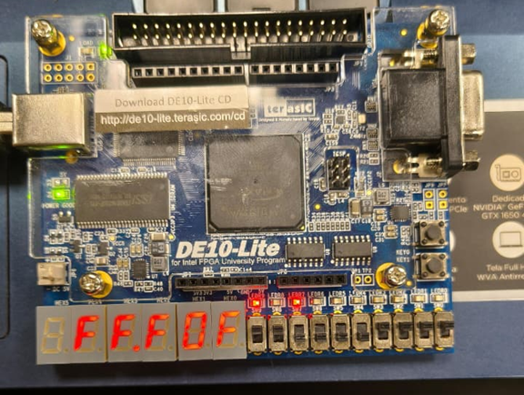

# Tutorial: Implementação de Somador Ponto Flutuante na DE10-Lite

**Autores:** Daniel Mendes Vale de Sá (11201921422), Gabrielly Souza Santiago (11202231242), Pedro Henrique de Moraes Lui (11201722622).

**Disciplina:** Sistemas Digitais Q2.2026

**Data:** 09/08/2026

---
*Etapa 1*
## 1. Objetivo do Projeto
Este projeto adapta o somador de ponto flutuante simplificado (13 bits) do livro-texto para a placa Terasic DE10-Lite (MAX 10). O objetivo é demonstrar a síntese lógica e a simulação de hardware usando VHDL.

## 2. Descrição gráfica do funcionamento do sistema

O sistema implementa um somador de ponto flutuante simplificado de 13 bits. Cada operando possui três campos:

| Campo        | Quantidade de bits | Entradas do operando A | Entradas do operando B |
| ------------ | -----------------: | ---------------------- | ---------------------- |
| Sinal (s)    |                  1 | `sign1`                | `sign2`                |
| Expoente (e) |                  4 | `exp1(3 downto 0)`     | `exp2(3 downto 0)`     |
| Fração (f)   |                  8 | `frac1(7 downto 0)`    | `frac2(7 downto 0)`    |

O expoente é um inteiro **sem sinal e sem *bias***: os quatro bits representam diretamente os valores de 0 a 15. A fração também é sem sinal, de 0 a 255.

O valor representado por cada operando é:

$$
valor = (-1)^s \times 0.f \times 2^e
$$

Considerando a fração como um número inteiro de 8 bits, tem-se:

$$
valor = (-1)^s \times \frac{f}{256} \times 2^e
$$

**Premissa do formato.** Todo operando precisa estar **normalizado** (`frac(7) = '1'`) ou ser o **zero canônico** (`exp = "0000"` e `frac = "00000000"`). Essa premissa vem do livro e é assumida pelos quatro estágios do circuito; é ela que torna válida a comparação do primeiro estágio, descrita na seção 2.1. Com ela, a faixa representável é:

| | Valor |
| ------------------------- | ---------------------------- |
| Menor magnitude normalizada | `0.10000000 × 2^0` = 0,5 |
| Maior magnitude | `0.11111111 × 2^15` = 32 640 |

O circuito recebe dois operandos e realiza a soma em quatro etapas principais: comparação das magnitudes, alinhamento dos expoentes, soma (ou subtração) das frações e normalização do resultado.

A descrição a seguir corresponde ao núcleo adaptado (`rtl/fp_adder_fixed.vhd`), que é **puramente combinacional**: não há clock nem registradores entre as etapas, de modo que a palavra *estágio* indica uma etapa do algoritmo, e não um estágio de *pipeline*. Os pontos em que esse núcleo difere do original do livro estão marcados como **[D1]**, **[D2]** e **[D3]**: eles aparecem no 4º estágio (seção 2.4) e as divergências que produzem na simulação são comparadas na seção 4.



### Entradas e saídas

| Sinal | Tipo | Bits | Descrição |
|:------|:----:|:----:|:----------|
| `sign1` | Entrada | 1 | Bit de sinal do primeiro operando |
| `exp1` | Entrada | 4 | Expoente do primeiro operando |
| `frac1` | Entrada | 8 | Fração do primeiro operando |
| `sign2` | Entrada | 1 | Bit de sinal do segundo operando |
| `exp2` | Entrada | 4 | Expoente do segundo operando |
| `frac2` | Entrada | 8 | Fração do segundo operando |
| `sign_out` | Saída | 1 | Bit de sinal do resultado |
| `exp_out` | Saída | 4 | Expoente do resultado |
| `frac_out` | Saída | 8 | Fração do resultado |

Além dessas, o núcleo adaptado possui cinco saídas de diagnóstico, acrescentadas para levar sinais internos até os LEDs da placa. Elas não influenciam o resultado e podem ser deixadas em `open`:

| Sinal | Tipo | Bits | Descrição |
|:------|:----:|:----:|:----------|
| `dbg_exp_diff` | Saída | 4 | Deslocamento aplicado no 2º estágio (`exp_diff`) |
| `dbg_leado` | Saída | 3 | Zeros à esquerda contados no 4º estágio (`leado`) |
| `dbg_carry` | Saída | 1 | Carry-out do 3º estágio (`sum(8)`) |
| `dbg_zero` | Saída | 1 | Resultado nulo por cancelamento exato (`sum = 0`) |
| `dbg_ovf` | Saída | 1 | Saturação por estouro de expoente |

### 2.1 Primeiro estágio: ordenação dos operandos

O primeiro estágio identifica qual operando possui a maior magnitude.

A comparação é feita usando a concatenação do expoente com a fração:

```vhdl
exp1 & frac1
exp2 & frac2
```

Como o expoente ocupa os bits mais significativos da concatenação, ele é comparado primeiro; havendo empate no expoente, a decisão passa para a fração:

```vhdl
if unsigned(exp1 & frac1) > unsigned(exp2 & frac2) then
    -- operando 1 é o maior
else
    -- operando 2 é o maior
end if;
```

O código original do livro escreve a mesma condição sem a conversão, como `(exp1 & frac1) > (exp2 & frac2)`. Nesse caso a comparação é lexicográfica sobre o tipo do vetor, e não numérica, o que gera um aviso no GHDL. Para vetores de mesmo comprimento formados apenas por `'0'` e `'1'` o resultado é idêntico, de modo que a conversão explícita para `unsigned` não altera o hardware — apenas declara a intenção e elimina o aviso.

**Por que comparar o padrão de bits funciona.** Essa comparação só equivale a comparar as magnitudes porque o formato exige operandos normalizados ou iguais a zero. Se um operando não normalizado for aplicado ao núcleo (`frac(7) = '0'` com `frac /= 0`), a equivalência se perde: o operando escolhido como maior pode ter a fração menor, a subtração de 9 bits do 3º estágio pede emprestado, e esse empréstimo retorna pelo bit 8, que o 4º estágio interpreta como carry. O resultado sai com sinal e magnitude incorretos. Trata-se de uma **pré-condição do núcleo**, e não de um defeito dele: garanti-la é responsabilidade de quem alimenta o núcleo. É exatamente por isso que a versão da DE10-Lite valida os operandos antes de entregá-los ao somador, como descrito na seção 3.

O maior operando é armazenado nos sinais terminados em `b`, de *big*:

```text
signb
expb
fracb
```

O menor operando é armazenado nos sinais terminados em `s`, de *small*:

```text
signs
exps
fracs
```

### 2.2 Segundo estágio: alinhamento dos expoentes

Para somar dois números de ponto flutuante, as duas frações precisam estar associadas ao mesmo expoente.

Primeiro é calculada a diferença entre os expoentes:

```vhdl
exp_diff <= expb - exps;
```

Como `expb` pertence ao operando de maior magnitude, a diferença é sempre maior ou igual a zero.

Depois, a fração do menor operando é deslocada para a direita:

```vhdl
fraca <= shift_right(fracs, to_integer(exp_diff));
```

O sufixo `a` indica que o valor está alinhado, de *aligned*.

Os bits que saem pela direita são simplesmente **descartados**: o circuito não faz arredondamento nem utiliza bits de guarda, como no projeto original. Esse truncamento é a origem do erro numérico do algoritmo. Quando `exp_diff` é maior ou igual a 8, todos os bits da fração menor são descartados e `fraca` resulta em zero, ou seja, o operando de menor magnitude não influencia o resultado.

### 2.3 Terceiro estágio: soma ou subtração

O circuito utiliza representação sinal-magnitude. Por isso, a operação depende dos sinais dos operandos.

| Condição         | Operação                 |
| ---------------- | ------------------------ |
| `signb = signs`  | Soma das magnitudes      |
| `signb /= signs` | Subtração das magnitudes |

A operação pode ser representada por:

```vhdl
sum <= ('0' & fracb) + ('0' & fraca) when signb = signs else
       ('0' & fracb) - ('0' & fraca);
```

As frações possuem 8 bits, mas a soma é feita com 9 bits:

```text
'0' & fracb
'0' & fraca
```

O bit adicional permite armazenar o carry da soma:

```text
sum(8) = carry-out
```

Como os operandos estão ordenados e normalizados, na subtração vale sempre `fracb >= fraca`, de modo que `sum(8)` só pode valer `'1'` no caso de soma.

O sinal do resultado é o sinal do operando de maior magnitude, `signb`, porque em uma subtração entre magnitudes o resultado possui o sinal do operando de maior módulo. Esse sinal, no entanto, não é definido aqui: quem o atribui é o 4º estágio, que também precisa tratar os casos em que o resultado é zero. Nesses casos o sinal é forçado a `'0'`, conforme descrito na seção 2.4.

### 2.4 Quarto estágio: normalização

Após a soma ou subtração, o resultado pode não estar no formato normalizado esperado.

O quarto estágio realiza quatro operações:

1. verifica se o resultado da soma é nulo;
2. verifica se houve carry;
3. conta os zeros à esquerda;
4. ajusta o sinal, a fração e o expoente.

#### Detecção de resultado nulo

O teste de resultado nulo é explícito e observa os nove bits da soma:

```vhdl
is_zero <= '1' when sum = 0 else '0';
```

**[D2]** No circuito original não existe esse teste: o caso de cancelamento exato era deduzido a partir do contador de zeros à esquerda, que satura e não distingue `sum = 0` de `sum = 1`, como mostra a tabela a seguir.

#### Contagem de zeros à esquerda

O sinal `leado` informa quantos deslocamentos para a esquerda são necessários para colocar o primeiro bit `1` na posição mais significativa da fração.

| `sum(7 downto 0)` | `leado` |
| ----------------- | ------- |
| `1xxxxxxx`        | `000`   |
| `01xxxxxx`        | `001`   |
| `001xxxxx`        | `010`   |
| `0001xxxx`        | `011`   |
| `00001xxx`        | `100`   |
| `000001xx`        | `101`   |
| `0000001x`        | `110`   |
| `00000001`        | `111`   |
| `00000000`        | `111` ← **mesmo código** |

A contagem observa apenas `sum(7 downto 0)`, ignorando o bit de carry, e satura em 7. Por isso as duas últimas linhas compartilham o mesmo código: o contador sozinho não distingue "sobrou o bit menos significativo" de "não sobrou bit nenhum". No circuito adaptado essa ambiguidade é inofensiva, porque o caso `sum = 0` já foi resolvido pelo sinal `is_zero`; no circuito original ela é a origem do defeito **[D2]**.

O deslocamento é feito por:

```vhdl
sum_norm <= shift_left(sum(7 downto 0), to_integer(leado));
```

#### Decisão do resultado final

As situações abaixo formam uma **cadeia de prioridade**, e não condições independentes: elas são avaliadas na ordem da tabela e a primeira que for verdadeira define a saída. A ordem importa porque duas delas podem ocorrer ao mesmo tempo. Por exemplo, somando `0.10000000 × 2^0` com ele mesmo tem-se `sum = 100000000`, com carry igual a `1` e, ao mesmo tempo, `leado = 7` maior que `expb = 0`. O ramo de carry tem prioridade e produz o resultado correto, `0.10000000 × 2^1` = 1,0.

| Prioridade | Situação                                | Sinal   | Expoente     | Fração        | Observação |
| :--------: | --------------------------------------- | ------- | ------------ | ------------- | ---------- |
| 1 | Resultado igual a zero (`is_zero = '1'`)          | `'0'`   | `0000`       | `00000000`    | **[D1][D2]** zero canônico, sem sinal |
| 2 | Carry igual a `1` **e** `expb = 1111`             | `signb` | `1111`       | `11111111`    | **[D3]** satura no maior valor representável e ativa `dbg_ovf` |
| 3 | Carry igual a `1`                                 | `signb` | `expb + 1`   | `sum(8 downto 1)` | Fração deslocada uma posição para a direita e expoente incrementado |
| 4 | `leado > expb`                                    | `'0'`   | `0000`       | `00000000`    | **[D1]** pequeno demais para ser normalizado, convertido em zero |
| 5 | Caso normal                                       | `signb` | `expb - leado` | `sum_norm`  | Fração deslocada para a esquerda e expoente reduzido |

As correções em relação ao circuito original aparecem nas prioridades 1, 2 e 4:

- **[D1]** o zero sai sempre sem sinal. No original o sinal era sempre `signb`, de modo que um resultado nulo obtido a partir de um operando negativo saía como "menos zero" e o display mostraria o traço de menos junto de `00.0`.
- **[D2]** o cancelamento exato é tratado antes de tudo, com o teste explícito `sum = 0`. No original, quando os dois operandos se anulavam e o expoente do maior era grande, o teste `leado > expb` não disparava e a saída ficava com fração nula e expoente diferente de zero, uma representação inválida para o formato.
- **[D3]** o carry com o expoente já no valor máximo satura no maior número representável. No original, `expb + 1` em quatro bits dava a volta para `0000` e o maior número da faixa virava o menor.

*Etapa 2*
## 3. Adaptações de Hardware (DE10-Lite)
O projeto original foi desenvolvido para uma plataforma FPGA diferente da DE10-Lite. Para possibilitar sua utilização na placa, foi criada uma nova interface de hardware, preservando o **algoritmo de quatro estágios** do somador e reescrevendo os módulos responsáveis pela interação com o usuário e pela visualização dos resultados.

O núcleo do somador não ficou intocado: o 4º estágio recebeu as três correções **[D1]**, **[D2]** e **[D3]** descritas na seção 2.4, e os dois deslocadores escritos como tabelas `with ... select` foram trocados pelas funções `shift_right` e `shift_left` do `numeric_std`, que geram o mesmo *barrel shifter*. O núcleo efetivamente sintetizado é o adaptado, `rtl/fp_adder_fixed.vhd`: o projeto do Quartus inclui apenas `fp_adder_fixed.vhd`, `hex_to_sseg.vhd`, `debounce.vhd` e o nível de topo `fp_adder_de10lite.vhd`. O `rtl/fp_adder.vhd`, transcrição do livro, permanece no repositório somente como referência para a comparação da seção 4 e não entra na síntese.

### O que mudamos no VHDL original

- **Removemos o módulo `disp_mux`.** No circuito original, os quatro displays de sete segmentos compartilhavam os mesmos sinais e eram acionados alternadamente pelo módulo `disp_mux`. Como a DE10-Lite possui seis displays independentes (`HEX0` a `HEX5`), cada um com seu próprio barramento, esse módulo deixou de ser necessário e foi removido, junto com os contadores que a multiplexação exigia. A exibição passou a ser puramente combinacional e ainda sobraram dois displays, aproveitados para o eco do campo que está sendo carregado.

- **Removemos os operandos fixos.** O circuito original utilizava parte dos operandos fixa porque a placa possuía poucas chaves de entrada. Na DE10-Lite, os dois operandos passaram a ser armazenados em registradores e carregados campo a campo pelas chaves e botões, permitindo representar qualquer combinação de entradas.

- **Reorganizamos as entradas.** As chaves `SW(9 downto 8)` passaram a selecionar o campo que será carregado e `SW(7 downto 0)` fornecem os dados. O botão `KEY(0)` realiza a carga do campo selecionado e `KEY(1)` executa o reset. Os botões da DE10-Lite são ativos em nível baixo, ao contrário dos do livro, e por isso são invertidos na entrada do circuito.

- **Adicionamos o anti-repique nos dois botões.** Sem ele, um único toque geraria vários pulsos de carga durante o repique mecânico e o valor escrito no registrador seria imprevisível. O módulo `debounce` reúne três partes: dois flip-flops em série que sincronizam a entrada assíncrona ao clock, um contador que só deixa o nível estável mudar depois que a entrada permanece diferente por toda a janela, e um detector que gera um pulso de um único ciclo nas bordas. Com `DEB_BITS = 20`, a janela vale 2¹⁹ = 524 288 ciclos, ou **10,486 ms** a 50 MHz — folgado sobre o repique mecânico típico, de 1 a 10 ms.

  Existem **duas instâncias** desse módulo. `KEY(0)` usa o pulso de borda, que carrega o campo selecionado; `KEY(1)` usa o nível estável, que serve de reset síncrono para o banco de registradores. Filtrar também o botão de reset é necessário porque, ligado diretamente, um pulso espúrio de poucos nanossegundos bastaria para apagar os dois operandos — o período do clock é de apenas 20 ns.

- **Bloqueamos a carga espúria após o reset.** O reset zera o estado interno do anti-repique de `KEY(0)`, inclusive quando o botão está pressionado. Ao sair do reset, o anti-repique enxerga uma transição de solto para pressionado e emite um pulso de borda que não corresponde a nenhum toque, sobrescrevendo um campo do par padrão. Para evitar isso, o sinal `armed` só habilita a carga depois de o botão ter sido visto **solto** ao menos uma vez desde o último reset.

- **Roteamos sinais internos para os LEDs.** Os sinais de diagnóstico dos estágios 2, 3 e 4 do somador (`dbg_exp_diff`, `dbg_leado`, `dbg_carry` e `dbg_ovf`) foram ligados aos LEDs (`LEDR`) para que o funcionamento do algoritmo possa ser conferido na própria placa, e não apenas no simulador.

- **Reescrevemos o decodificador de sete segmentos.** O `hex_to_sseg` do livro foi escrito para uma placa Digilent, cujo mapeamento de bits é o inverso do da DE10-Lite: lá o bit mais significativo do vetor é o segmento `a`, aqui é `HEXn(0) = a`, `HEXn(1) = b`, e assim por diante até `HEXn(6) = g`. Reaproveitar a tabela original acenderia os segmentos espelhados, e o dígito `2` apareceria como `5`. Além disso, na DE10-Lite o ponto decimal é o **bit 7 do próprio barramento do display**, e não um pino separado. Os displays são de anodo comum, ou seja, o segmento acende com `'0'`.

- **Adicionamos a validação dos operandos.** No circuito original, a fração era montada de forma que o bit mais significativo fosse sempre `1`, garantindo que o operando estivesse normalizado. Como na DE10-Lite os operandos são carregados livremente pelas chaves, passou a ser possível inserir valores não normalizados. Nesses casos, o circuito poderia identificar incorretamente o operando de maior magnitude e produzir resultados com sinal e magnitude incorretos, como explicado na seção 2.1. Para evitar esse problema, foi adicionada uma etapa de validação entre os registradores e o núcleo do somador. Se um operando não estiver normalizado e também não representar o zero canônico, ele é tratado como zero.

  A substituição por zero acontece **apenas na entrada do núcleo**, nos sinais terminados em `_eff`: o registrador continua guardando o valor que foi digitado. É por isso que o eco nos displays mostra o valor bruto, enquanto o **ponto decimal** de `HEX1` (operando A) e de `HEX0` (operando B) avisa qual dos dois está sendo tratado como zero.

- **Tornamos o comportamento de energização explícito.** Todos os registradores têm valor inicial escrito no RTL, iguais aos valores de reset. Assim o par de operandos padrão já está presente ao ligar a placa, e a simulação parte do mesmo estado, em vez de começar com os sinais indefinidos.

### Descrição gráfica do sistema



### Interface da DE10-Lite

| Recurso | Função |
|---------|--------|
| `MAX10_CLK1_50` | Clock de 50 MHz, usado pelo anti-repique e pelos registradores. O núcleo do somador continua combinacional |
| `SW(9 downto 8)` | Seleciona o campo do operando que será carregado |
| `SW(7 downto 0)` | Dados do campo, quando o campo selecionado é uma fração |
| `SW(4)` e `SW(3 downto 0)` | Sinal e expoente, quando o campo selecionado é sinal e expoente. Nesse caso `SW(7 downto 5)` é ignorado |
| `KEY(0)` | Carrega o campo selecionado (pressionado = nível baixo) |
| `KEY(1)` | Reinicia os registradores com os valores padrão (pressionado = nível baixo) |
| `HEX5` | Sinal do resultado: traço quando negativo, display apagado quando positivo |
| `HEX4` e `HEX3` | Fração do resultado. O ponto decimal de `HEX3` fica **sempre aceso**, separando a fração do expoente |
| `HEX2` | Expoente do resultado |
| `HEX1` | Eco do campo selecionado, dígito mais significativo. **Ponto decimal aceso: o operando A é inválido e está sendo tratado como zero** |
| `HEX0` | Eco do campo selecionado, dígito menos significativo. **Ponto decimal aceso: idem para o operando B** |
| `LEDR(3 downto 0)` | Diferença entre os expoentes (`exp_diff`) |
| `LEDR(6 downto 4)` | Quantidade de zeros à esquerda (`leado`) |
| `LEDR(7)` | Carry da soma |
| `LEDR(8)` | Resultado nulo, tanto por cancelamento exato quanto por conversão para zero |
| `LEDR(9)` | Saturação por estouro de expoente |

O eco de `HEX1` e `HEX0` mostra o conteúdo atual do campo apontado por `SW(9 downto 8)`, sempre com o valor que foi carregado, e não o valor saneado. Assim é possível ver o que foi digitado ao mesmo tempo em que o ponto decimal avisa que aquele operando está sendo tratado como zero.

Os valores apresentados nos displays de sete segmentos são exibidos em formato hexadecimal. Dessa forma, cada display representa 4 bits do valor correspondente. Por exemplo, uma fração `10100000` é exibida como `A0` nos displays, pois `1010 = A` e `0000 = 0`.

A leitura do painel é direta: `HEX5 HEX4 HEX3. HEX2` corresponde a `s 0,FF × 2^E`.

### Valores padrão dos operandos

Ao ligar a placa, e também após cada acionamento de `KEY(1)`, os registradores assumem:

| Operando | Sinal | Expoente | Fração | Valor |
| -------- | ----- | -------- | ------ | ----- |
| A | `0` | `0100` | `11000000` | `+0.11000000 × 2^4` = +12 |
| B | `0` | `0010` | `10000000` | `+0.10000000 × 2^2` = +2 |

O resultado exibido nessa condição é `+0.11100000 × 2^4` = +14, ou seja, `HEX4 HEX3. HEX2` mostrando `E0.4` com o display de sinal apagado.

### Seleção dos campos dos operandos por SW(9 downto 8)

| `SW(9 downto 8)` | Campo carregado                | Dados                      |
| ---------------- | ------------------------------ | -------------------------- |
| `00`             | Fração do operando A           | `SW(7 downto 0)`           |
| `01`             | Sinal e expoente do operando A | `SW(4)` e `SW(3 downto 0)` |
| `10`             | Fração do operando B           | `SW(7 downto 0)`           |
| `11`             | Sinal e expoente do operando B | `SW(4)` e `SW(3 downto 0)` |

## 4. Evidências de Validação

### Simulação

A validação por simulação está dividida em cinco testbenches, cada um com um papel próprio:

| Testbench | Papel |
| --------- | ----- |
| `sim/tb_fp_adder_orig.vhd` | Etapa 1: mede o que o RTL original do livro faz, comparando-o com um modelo do algoritmo do livro |
| `sim/tb_fp_adder_fixed.vhd` | Etapa 2: valida o núcleo adaptado e compara os dois núcleos vetor a vetor |
| `sim/tb_fp_precision.vhd` | Mede o erro numérico do algoritmo contra a soma exata |
| `sim/tb_fp_adder_de10lite.vhd` | Valida o nível de topo: carga pelas chaves, anti-repique, reset, saneamento e displays |
| `sim/tb_fp_adder_waves.vhd` | Gera as formas de onda e a tabela de casos dirigidos usadas neste relatório |

Os dois primeiros aplicam o mesmo estímulo, organizado em cinco níveis:

| Nível | Vetores | O que cobre |
| ----- | ------: | ----------- |
| Casos dirigidos | 14 | Os quatro cenários de normalização, os três defeitos e casos de borda |
| Varredura densa | 147 456 | Todos os expoentes (16 × 16) × todos os sinais (2 × 2) × 12 significandos representativos (12 × 12) |
| Varredura com operando zero | 769 | O operando zero contra todo o resto |
| Varredura de cobertura | 32 784 | Cada um dos 4 098 operandos legais, dos dois lados, contra um conjunto fixo de parceiros |
| Pseudoaleatório | 100 000 | Gerador LFSR de semente fixa, reproduzível em qualquer simulador |
| **Total** | **281 023** | |

A cobertura não é estimada: o testbench registra quais operandos foram efetivamente aplicados e reprova se faltar algum. Os 4 098 operandos legais do formato — 4 096 normalizados (128 significandos × 16 expoentes × 2 sinais) mais os dois zeros canônicos — são todos alcançados.

Para a inspeção visual, o `tb_fp_adder_waves` executa os 14 casos dirigidos, um a cada 100 ns, com os dois núcleos lado a lado e os sinais internos de cada estágio trazidos para o nível de topo do testbench.



**Figura 1 – Captura do GTKWave com os casos dirigidos. De cima para baixo: as entradas, os sinais internos dos estágios 1 a 4, a saída do núcleo original do livro, a saída do núcleo adaptado, o marcador `divergem` e o índice `case_id` do caso em execução.**

Os mesmos dados estão em `sim/waves/directed_cases.csv`, gravado pelo próprio testbench durante a simulação, e são a fonte do diagrama alternativo em `docs/img/waveform_estagios.svg`. O testbench confere cada caso contra os modelos de referência antes de gravar a tabela: uma figura gerada a partir de saídas erradas não passaria despercebida.

Entre os casos simulados, destacam-se quatro situações relacionadas ao 4º estágio do circuito, responsável pela normalização:

| Caso | Situação | Resultado observado |
|:----:|----------|---------------------|
| `C1` | Carry-out | `sum = 352` ultrapassa 8 bits, `carry_dbg` é ativado e o resultado sai normalizado com o expoente incrementado de 3 para 4. |
| `C3` | Normalização de 7 casas | `sum = 1` e `leado_dbg = 7`, indicando que a fração precisa ser deslocada 7 posições para a esquerda. Como `expb = 9`, o deslocamento cabe e o expoente cai para 2. |
| `C4` | Resultado pequeno demais, convertido em zero | `leado_dbg = 7` é maior que `expb = 3`, então o resultado não pode ser normalizado e a saída é o zero canônico. |
| `C6` | Estouro do expoente | Há carry com `expb = 15`: `ovf_dbg` é ativado e o resultado satura no maior valor representável. |

O cancelamento exato, em que a soma dos significandos dá exatamente zero e `zero_dbg` é ativado, ocorre nos casos `C5` e `C10` — em que os operandos se anulam — e também em `C9`, que soma zero com zero.

### Etapa 1 — o que o circuito original faz

O `tb_fp_adder_orig` aplica os mesmos 281 023 vetores ao `rtl/fp_adder.vhd`, transcrito do livro sem nenhuma alteração, e compara a saída com um modelo do algoritmo do livro:

```
 RESUMO ETAPA 1
   vetores aplicados .................. 281023
   DUT == modelo do algoritmo do livro  281023
   DUT != modelo (FALHA) .............. 0
   livro == corrigido ................. 275930
   [D1] menos zero .................... 1064
   [D2] cancelamento exato nao canonico 204
   [D3] estouro de expoente ........... 3825
   divergencias imprevistas (FALHA) ... 0
```

Ou seja: o RTL do livro faz exatamente o que o algoritmo do livro manda, em 100 % dos vetores, inclusive quando o algoritmo está errado. As 5 093 diferenças em relação ao algoritmo corrigido, 1,81 % do total, caem em exatamente três famílias — D1, D2 e D3 —, e em cada uma delas o testbench exige do circuito original o valor errado específico que ele deve produzir, e não apenas que a entrada pertença a uma classe conhecida.

### Comparação entre o circuito original e o adaptado

A simulação também compara diretamente as saídas do núcleo original do livro com as saídas do núcleo adaptado para a DE10-Lite.

O sinal `divergem`, apresentado na parte inferior da forma de onda, indica os casos em que as duas implementações produzem resultados diferentes. Essas divergências são esperadas: elas ocorrem exatamente nas situações em que o circuito adaptado corrige uma das limitações identificadas no original. Entre os 14 casos dirigidos, `divergem` se ativa em quatro:

| Caso | Situação | Motivo da divergência |
|:----:|----------|-----------------------|
| `C4` | Resultado pequeno demais, convertido em zero | **[D1]** o operando de maior magnitude é negativo, então a versão original produz o zero com sinal negativo. A versão adaptada gera o zero canônico. |
| `C5` | Cancelamento exato com expoente alto | **[D2]** a versão adaptada gera o zero canônico quando os operandos se anulam; a original produz fração nula com expoente diferente de zero. |
| `C6` | Estouro do expoente | **[D3]** a versão adaptada satura no maior valor representável; na original o expoente dá a volta e o maior número da faixa vira o menor. |
| `C10` | Cancelamento exato com expoente baixo | **[D1]** a versão adaptada evita a representação do zero com sinal negativo. |

### Código VHDL Final

A implementação final mantém o algoritmo de quatro estágios, com as correções [D1], [D2] e [D3] no núcleo, e adiciona os elementos necessários para sua utilização na DE10-Lite. A seguir são apresentados os principais trechos da adaptação.

#### Constantes, clock e botões

Na parte declarativa da arquitetura ficam os padrões de segmento usados fora do decodificador hexadecimal e os valores de reset dos dois operandos. Os registradores recebem esses mesmos valores como valor inicial, o que torna o estado de energização parte da especificação, em vez de depender da inferência da ferramenta de síntese.

```vhdl
constant SSEG_BLANK : std_logic_vector(6 downto 0) := "1111111";
constant SSEG_MINUS : std_logic_vector(6 downto 0) := "0111111";  -- so o segmento g

constant A_SIGN_RST : std_logic                    := '0';
constant A_EXP_RST  : std_logic_vector(3 downto 0) := "0100";
constant A_FRAC_RST : std_logic_vector(7 downto 0) := "11000000";
constant B_SIGN_RST : std_logic                    := '0';
constant B_EXP_RST  : std_logic_vector(3 downto 0) := "0010";
constant B_FRAC_RST : std_logic_vector(7 downto 0) := "10000000";

signal a_sign : std_logic := A_SIGN_RST;
signal b_sign : std_logic := B_SIGN_RST;
signal a_exp  : std_logic_vector(3 downto 0) := A_EXP_RST;
signal b_exp  : std_logic_vector(3 downto 0) := B_EXP_RST;
signal a_frac : std_logic_vector(7 downto 0) := A_FRAC_RST;
signal b_frac : std_logic_vector(7 downto 0) := B_FRAC_RST;
```

No corpo da arquitetura, o clock da placa é ligado ao circuito e os dois botões são invertidos, já que na DE10-Lite pressionado corresponde a nível baixo. É desses dois sinais em lógica ativa-alta que o anti-repique parte.

```vhdl
clk <= MAX10_CLK1_50;

key0_press <= not KEY(0);
key1_press <= not KEY(1);
```

#### Carregamento dos operandos

Os operandos são armazenados em registradores. As chaves `SW(9 downto 8)` selecionam qual campo será carregado.

```vhdl
process(clk)
begin
   if rising_edge(clk) then
      if reset = '1' then
         a_sign <= A_SIGN_RST;
         a_exp  <= A_EXP_RST;
         a_frac <= A_FRAC_RST;
         b_sign <= B_SIGN_RST;
         b_exp  <= B_EXP_RST;
         b_frac <= B_FRAC_RST;

      elsif load_en = '1' then
         case SW(9 downto 8) is
            when "00" =>
               a_frac <= SW(7 downto 0);

            when "01" =>
               a_sign <= SW(4);
               a_exp  <= SW(3 downto 0);

            when "10" =>
               b_frac <= SW(7 downto 0);

            when others =>
               b_sign <= SW(4);
               b_exp  <= SW(3 downto 0);
         end case;
      end if;
   end if;
end process;
```

#### Debounce dos botões

Os dois botões passam pelo mesmo módulo de *debounce*, mas usam saídas diferentes: `KEY(1)` aproveita o **nível estável**, que serve de reset, e `KEY(0)` aproveita o **pulso de borda**, garantindo que cada pressão gere uma única carga. A instância do reset recebe `reset => '0'` porque é ela que gera o reset do restante do circuito e não teria de onde tirar um.

```vhdl
deb_reset : entity work.debounce
   generic map (CNT_BITS => DEB_BITS)
   port map (
      clk   => clk,
      reset => '0',
      din   => key1_press,
      level => reset,
      rise  => open,
      fall  => open
   );

deb_load : entity work.debounce
   generic map (CNT_BITS => DEB_BITS)
   port map (
      clk   => clk,
      reset => reset,
      din   => key0_press,
      level => open,
      rise  => load_pulse,
      fall  => open
   );
```

#### Trava de carga após o reset

O pulso de carga só é aceito depois de o botão ter sido visto solto ao menos uma vez desde o último reset. Sem essa trava, um reset dado com `KEY(0)` pressionado produziria uma carga espúria ao sair do reset.

```vhdl
process(clk)
begin
   if rising_edge(clk) then
      key0_sync <= key0_sync(0) & key0_press;
      if reset = '1' then
         armed <= '0';
      elsif key0_sync(1) = '0' then
         armed <= '1';
      end if;
   end if;
end process;

load_en <= load_pulse and armed;
```

#### Validação dos operandos

Antes de serem enviados ao núcleo do somador, os operandos são verificados. Um operando é válido quando sua fração está normalizada ou quando representa o zero canônico.

```vhdl
a_ok <= '1' when a_frac(7) = '1'
                or (a_frac = "00000000" and a_exp = "0000") else '0';

b_ok <= '1' when b_frac(7) = '1'
                or (b_frac = "00000000" and b_exp = "0000") else '0';

a_sign_eff <= a_sign when a_ok = '1' else '0';
a_exp_eff  <= a_exp  when a_ok = '1' else "0000";
a_frac_eff <= a_frac when a_ok = '1' else "00000000";

b_sign_eff <= b_sign when b_ok = '1' else '0';
b_exp_eff  <= b_exp  when b_ok = '1' else "0000";
b_frac_eff <= b_frac when b_ok = '1' else "00000000";

a_bad <= not a_ok;
b_bad <= not b_ok;
```

#### Conexão com o núcleo do somador

Após o carregamento e a validação, os operandos são enviados ao núcleo `fp_adder_fixed`.

```vhdl
fp_add_unit : entity work.fp_adder_fixed
   port map (
      sign1 => a_sign_eff,
      sign2 => b_sign_eff,

      exp1  => a_exp_eff,
      exp2  => b_exp_eff,

      frac1 => a_frac_eff,
      frac2 => b_frac_eff,

      sign_out => r_sign,
      exp_out  => r_exp,
      frac_out => r_frac,

      dbg_exp_diff => d_expdiff,
      dbg_leado    => d_leado,
      dbg_carry    => d_carry,
      dbg_zero     => open,
      dbg_ovf      => d_ovf
   );
```

#### Eco do campo selecionado

O sinal `echo` é um multiplexador de quatro entradas comandado pelas mesmas chaves que escolhem o campo a carregar. Ele mostra o conteúdo atual desse campo, sempre com o valor **carregado**, e não com o valor saneado, para que se veja o que foi digitado. Nos campos de sinal e expoente, os três bits altos são preenchidos com zero, de modo que o dígito da esquerda exibe o sinal e o da direita, o expoente.

```vhdl
with SW(9 downto 8) select
   echo <= a_frac                 when "00",
           "000" & a_sign & a_exp when "01",
           b_frac                 when "10",
           "000" & b_sign & b_exp when others;
```

#### Displays e LEDs de diagnóstico

O resultado é enviado aos displays de sete segmentos e os sinais internos são apresentados nos LEDs para facilitar a validação do circuito. `HEX1` e `HEX0` mostram o eco do campo selecionado, e seus pontos decimais são acionados por `a_bad` e `b_bad`, avisando qual operando está sendo tratado como zero.

```vhdl
HEX5 <= '1' & SSEG_MINUS when r_sign = '1'
        else '1' & SSEG_BLANK;

u_hex4 : entity work.hex_to_sseg
   port map (
      hex  => r_frac(7 downto 4),
      dp   => '0',
      sseg => HEX4
   );

u_hex3 : entity work.hex_to_sseg
   port map (
      hex  => r_frac(3 downto 0),
      dp   => '1',
      sseg => HEX3
   );

u_hex2 : entity work.hex_to_sseg
   port map (
      hex  => r_exp,
      dp   => '0',
      sseg => HEX2
   );

u_hex1 : entity work.hex_to_sseg
   port map (
      hex  => echo(7 downto 4),
      dp   => a_bad,
      sseg => HEX1
   );

u_hex0 : entity work.hex_to_sseg
   port map (
      hex  => echo(3 downto 0),
      dp   => b_bad,
      sseg => HEX0
   );

r_is_zero <= '1' when (r_exp = "0000" and r_frac = "00000000") else '0';

LEDR(3 downto 0) <= d_expdiff;
LEDR(6 downto 4) <= d_leado;
LEDR(7)          <= d_carry;
LEDR(8)          <= r_is_zero;
LEDR(9)          <= d_ovf;
```

### Síntese e compilação no Quartus

O projeto de síntese está em `quartus/fp_adder_de10lite.qpf`, com a entidade de topo `fp_adder_de10lite` e o dispositivo **MAX 10 10M50DAF484C7G**, que é o da DE10-Lite. Foi compilado no Quartus Prime Lite 25.1.

Entram na síntese quatro arquivos: `rtl/fp_adder_fixed.vhd`, `rtl/hex_to_sseg.vhd`, `rtl/debounce.vhd` e `rtl/fp_adder_de10lite.vhd`. Todo o RTL sintetizável foi escrito em **VHDL-93**, e não em VHDL-2008, porque o Quartus Prime Lite não habilita o VHDL-2008 por padrão. Essa compatibilidade é verificada na simulação, num passo que compila o RTL com `--std=93` antes de rodar os testbenches.

**Atribuição de pinos.** O `.qsf` traz **71 atribuições**, todas em `3.3-V LVTTL`:

| Recurso | Pinos |
| ------- | ----: |
| `MAX10_CLK1_50` | 1 |
| `SW(9 downto 0)` | 10 |
| `KEY(1 downto 0)` | 2 |
| `LEDR(9 downto 0)` | 10 |
| `HEX0` a `HEX5` (8 bits cada) | 48 |
| **Total** | **71** |

Atribuição de pino errada é um erro silencioso: o projeto compila, grava e o display apenas mostra lixo. Por isso os pinos foram conferidos contra fontes externas antes da compilação, e o script de build confere que o Fitter colocou cada pino exatamente onde o `.qsf` mandou.

**Restrições de tempo.** O arquivo `quartus/fp_adder_de10lite.sdc` declara o clock de 50 MHz da placa (período de 20 ns) e `derive_clock_uncertainty`. Como o somador é combinacional e o clock só existe por causa do anti-repique e dos registradores de operando, as chaves e os botões entram como `set_false_path` para os registradores, e os LEDs e displays como `set_false_path` na saída: são interfaces assíncronas e puramente visuais, sem requisito de tempo real. Sem essas restrições o Timing Analyzer reportaria violações que não têm significado físico aqui.

**Resultado.** A compilação completa (análise e síntese, Fitter, Assembler e Timing Analyzer) termina sem erros, e seu produto, o arquivo de configuração `quartus/output_files/fp_adder_de10lite.sof`, está versionado no repositório — é ele que foi gravado na placa para produzir as fotos da próxima seção, e permite regravar a DE10-Lite sem recompilar o projeto.

*Etapa 3*

### Funcionamento na Placa

Após a validação por simulação, o circuito foi testado na DE10-Lite utilizando os mesmos casos principais do 4º estágio de normalização. Os resultados são apresentados nos displays `HEX`, enquanto os LEDs `LEDR` indicam sinais internos utilizados para diagnóstico.

A conferência não é feita a olho. O testbench do nível de topo grava o estado de todos os pinos de saída em cada caso, e desse registro sai o **gabarito do painel**: os seis displays e os dez LEDs exatamente como devem aparecer na placa. Nos quatro casos a seguir, o painel fotografado coincide com o gabarito, dígito a dígito e LED a LED.



**Figura 2 – Gabarito do painel obtido na simulação do nível de topo, usado na conferência da placa.**

| Caso | Displays esperados | LEDs acesos |
|:----:|--------------------|-------------|
| `C1` | `b0.4` = `0.B0 × 2^4` = 11 | `LEDR(7)` (carry) e `LEDR(4)` (`leado = 1`) |
| `C3` | `-80.2` = `−0.80 × 2^2` = −2 | `LEDR(6 downto 4)` = `111` (`leado = 7`) |
| `C4` | `00.0` = zero canônico | `LEDR(8)` (resultado nulo) e `LEDR(6 downto 4)` = `111` |
| `C6` | `FF.F` = `0.FF × 2^15` = 32 640 | `LEDR(9)` (saturação) e `LEDR(7)` (carry) |

Nas fotos, os dois displays da direita mostram o eco do campo selecionado pelas chaves no momento do registro, e não fazem parte do resultado.

#### Caso C1 – Carry-out

Soma de `+6` com `+5`. Ocorre carry na soma dos significandos, o resultado é normalizado com o expoente ajustado de 3 para 4, e o `LEDR(7)` acende. Os displays mostram `b0.4`, ou seja, `0.B0 × 2^4` = 11.



#### Caso C3 – Normalização de 7 casas

Soma de `+256` com `−258`. A subtração dos significandos deixa apenas o bit menos significativo, e a fração precisa ser deslocada 7 posições para a esquerda para ser normalizada: os LEDs `LEDR(6 downto 4)` indicam `111`, correspondente a `leado = 7`. Como o expoente do maior operando é 9, o deslocamento cabe e o resultado é `−80.2`, isto é, `−0.80 × 2^2` = −2.



#### Caso C4 – Resultado pequeno demais, convertido em zero

Soma de `+4` com `−4,03125`. O resultado é pequeno demais para ser normalizado no formato, pois seriam necessários mais deslocamentos do que o expoente permite (`leado = 7` maior que `expb = 3`). Os displays apresentam `00.0`, o zero canônico, e o `LEDR(8)` acende, já que ele indica a saída nula, seja por cancelamento exato, seja por conversão para zero.



#### Caso C6 – Estouro do expoente

Soma do maior valor representável com ele mesmo. Há carry com o expoente já em 15, de modo que o resultado exigiria um expoente maior que o máximo do formato. O `LEDR(9)` acende para indicar a saturação e a saída fica presa em `FF.F` = `0.FF × 2^15` = 32 640, em vez de dar a volta no contador de expoente como faria o circuito original.



*Etapa 4*
## 5. Diário de Bordo de IA

Utilizamos Claude (nível de esforço extra) e ChatGPT (nível de esforço alto) para:

- Validação de lógica
- Identificação de edge cases
- Criação de scripts auxiliares para rodar testes de forma automatizada
- Criação de scripts para imagens de representação
- Auxílio na simulação
- Revisão de código
- Adição de comentários e cabeçalhos em arquivos de código fonte
- Revisão e refinamento do relatório (README.md)

**Análise crítica**

Em algumas situações os modelos se mostraram bastante confiantes, mas entravam em loop de erro, insistindo na mesma abordagem; nesses casos foi preciso interromper e redirecionar o trabalho. Na revisão final do projeto, dois problemas ainda apareceram, e os dois são de método:

- **O modelo de referência era circular.** O modelo contra o qual o circuito estava sendo verificado reimplementava os mesmos quatro estágios, em vez de calcular `a + b` pela definição do formato: comparava o algoritmo com uma paráfrase dele mesmo e não tinha como acusar erro nenhum. Reescrevemos como um oráculo de derivação independente, que soma exatamente e só então codifica o resultado.
- **A garantia de operando normalizado tinha se perdido.** Ao trocar os operandos fixos do livro por registradores carregados pelas chaves, a pré-condição do núcleo deixou de ser garantida. Foi o único problema que chegaria ao hardware, e a correção é o saneamento descrito na seção 3, sem o qual 275 456 pares de entrada produziriam resultado com o sinal errado.

De modo geral, o que funcionou foi **não aceitar a saída da ferramenta sem verificação cruzada**:

- exigir um modelo de referência de derivação independente, e não apenas de implementação diferente;
- exigir do testbench a **saída exata** em todo vetor, inclusive nos casos em que o circuito do livro erra;
- escrever o decodificador de 7 segmentos do testbench a partir dos segmentos acesos, e não copiando a tabela do RTL, já que comparar a tabela com ela mesma não verifica nada;
- exigir fonte externa para o mapa de pinos;
- usar **teste de mutação**, a única técnica que responde "os testes funcionam?" em vez de "os testes passam?".

Como avaliação geral: as ferramentas aceleraram a parte mecânica (automação dos testes, geração das figuras a partir dos dados de simulação, comentários e cabeçalhos, formatação do relatório) e ajudaram a levantar casos de borda que valia a pena testar.


## 6. Contribuição dos participantes

* **Daniel Mendes Vale de Sá**, Administração do Projeto, Software, Investigação, Redação (revisão e edição).
* **Gabrielly Souza Santiago**, Conceituação, Análise Formal, Visualização, Redação (rascunho original).
* **Pedro Henrique de Moraes Lui**, Metodologia, Validação, Curadoria de Dados, Redação (rascunho original).
