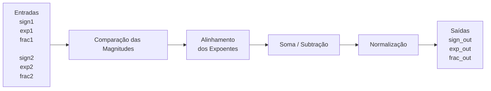

**template-somadorpf-vhdl**

# Tutorial: Implementação de Somador Ponto Flutuante na DE10-Lite

**Autores:** Gabrielly Souza Santiago (11202231242), Pedro Henrique de Moraes Lui (11201722622), Daniel Mendes Vale de Sá (11201921422)

**Disciplina:** Sistemas Digitais Q2.2026

**Data:** 07/08/2026

---
*Etapa 1*
## 1. Objetivo do Projeto
O objetivo deste projeto é validar o funcionamento do somador de ponto flutuante simplificado de 13 bits, adaptá-lo para a placa DE10-Lite e verificar, por meio de simulações e testes na FPGA, que as modificações realizadas não alteram a lógica matemática do circuito.

## 2. Descrição gráfica do funcionamento do sistema

O circuito recebe dois operandos em formato de ponto flutuante simplificado e realiza a soma em quatro etapas principais: comparação das magnitudes, alinhamento dos expoentes, soma (ou subtração) das frações e normalização do resultado.



### Entradas e saídas

| Sinal | Tipo | Descrição |
|:------|:----:|:----------|
| `sign1` | Entrada | Bit de sinal do primeiro operando |
| `exp1` | Entrada | Expoente do primeiro operando |
| `frac1` | Entrada | Fração do primeiro operando |
| `sign2` | Entrada | Bit de sinal do segundo operando |
| `exp2` | Entrada | Expoente do segundo operando |
| `frac2` | Entrada | Fração do segundo operando |
| `sign_out` | Saída | Bit de sinal do resultado |
| `exp_out` | Saída | Expoente do resultado |
| `frac_out` | Saída | Fração do resultado |

*Etapa 2*
## 3. Adaptações de Hardware (DE10-Lite)
Indicar o que a arquitetura original usava e quais mudanças foram feitas para a implementação na placa

**O que mudamos no VHDL original:**
* Removemos...
* Roteamos ...
* Reorganizamos ...

**Descrição gráfica do sistema**
* Caso mudar a descrição gráfica feita no item 2, atualizar aqui.
* Usar as variáveis de entrada e saída especificadas no VHDL.

## 4. Evidências de Validação

### Simulação 
Abaixo, a imagem do funcionamento do 4º estágio (normalização). Considerar os 4 casos detalhados.


### Código VHDL Final 
```vhdl
-- Insira aqui o VHDL final e faça ênfase nos trechos de código mais importantes da sua adaptação, isto é, eles devem estar claramente identificados.
```
*Etapa 3*

### Funcionamento na Placa
Abaixo, imagens do funcionamento na Placa para 4 casos.

*Etapa 4 (considerando qeu a Etapa 4 considera toda a documentação em si)*
## 5. Diário de Bordo de IA 
Utilizamos o [ChatGPT/Claude/Gemini] para auxiliar na geração do Testbench e na refatoração do código. Abaixo está a análise crítica do uso da ferramenta.

**Prompts Utilizados:**
> "Insira aqui o prompt exato que você usou..."

**O Erro da IA (Alucinação):**
> Descreva aqui o que a IA errou (ex: tentou usar pinos inexistentes, criou clock em testbench de circuito combinacional, etc).

**A Correção Humana:**
> Como você corrigiu o código gerado para que ele funcionasse na nossa placa e na simulação.

## 6. Contribuição dos participantes
Utilize a taxonomia CRediT, seguem exemplos:
 * [Nome do Aluno 1], Administração do Projeto, Desenvolvimento, implementação e teste de software, Análise Formal
 * [Nome do Aluno 2], Validação de dados e experimentos
 * [Nome do Aluno 3], Redação do manuscrito original, Validação de dados e experimentos
